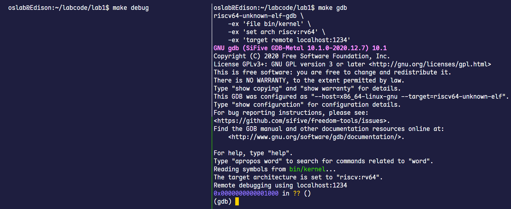
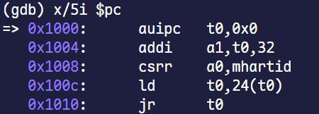
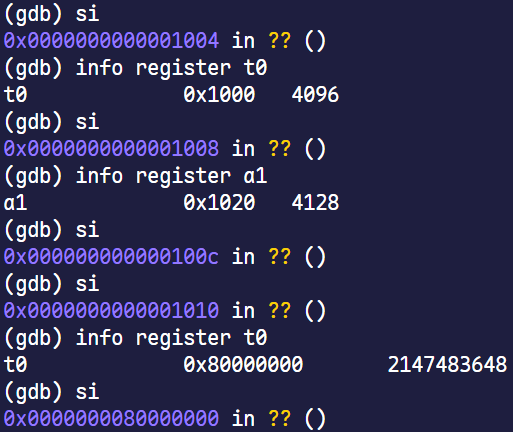
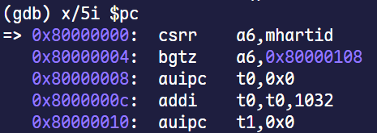
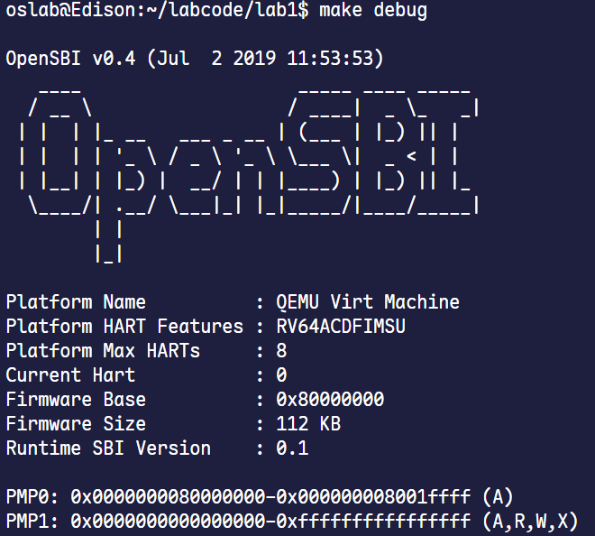
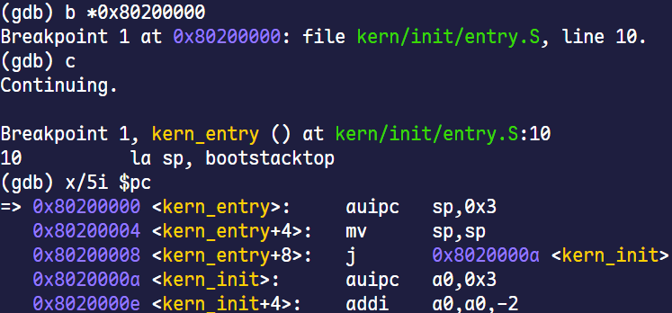

# Lab1实验报告

## 知识点梳理

### 一、 实验知识点与OS原理的映射

本实验虽然只是构建了一个最小化的内核，但它具体展现了操作系统理论中的几大基石。

**1. 系统启动流程 (Bootstrapping)**

* **实验体现**：我们通过 GDB 完整地跟踪了从 QEMU 加电复位（`0x1000`），到执行固件 OpenSBI（`0x80000000`），再到 OpenSBI 加载并跳转至内核入口（`0x80200000`）的全过程。这是一个具体、可见的启动链。
* **原理阐述**：操作系统原理中，将计算机从断电状态到操作系统内核完全接管控制权的过程称为“引导”或“自举”（Bootstrapping）。理论上，这个过程通常涉及硬件自检（POST）、加载固件（BIOS/UEFI），固件再加载引导加载程序（Bootloader, 如GRUB），最终由引导加载程序将内核映像加载到内存并跳转执行。
* **关系与理解**：本次实验是操作系统引导理论的一次“微缩实践”。其中，QEMU 的复位代码和 OpenSBI 共同扮演了固件和引导加载程序的角色。实验中的具体地址（`0x1000`, `0x80000000` 等）是理论在特定平台（QEMU模拟的RISC-V）上的具象化实现。理论描述的是一个通用模型，而实验则让我们看到了该模型在一个具体架构上的真实执行流。

**2. CPU特权级与硬件抽象**

* **实验体现**：我们观察到 OpenSBI 运行在机器模式（M-mode），而我们的内核运行在监控模式（S-mode）。内核为了实现字符输出，不能直接操作硬件，而是通过 `ecall` 指令调用 M-mode 的 OpenSBI 提供的服务（SBI Call）。
* **原理阐述**：操作系统原理的核心概念之一是**双重模式（Dual-Mode）**，即CPU至少拥有用户模式（User Mode）和内核模式（Kernel Mode）。内核模式拥有访问所有硬件的最高权限，而用户程序运行在受限的用户模式下，需要通过**系统调用（System Call）**陷入内核来请求服务。这是构建操作系统安全性的基础。
* **关系与理解**：实验中的 M-mode 和 S-mode 是 RISC-V 架构对双重模式理论的进一步细化。M-mode 权限最高，通常留给固件；S-mode 权限次之，用于运行操作系统内核。实验中从 S-mode 到 M-mode 的 `ecall` 调用，与原理中从用户模式到内核模式的系统调用，在机制上是完全一致的（都是通过特定指令触发陷阱，提升权限），都是为了实现**隔离和抽象**。差异在于，理论中的系统调用主要是为了保护内核免受用户程序的破坏，而实验中的 SBI 调用则是为了将内核与具体的硬件细节解耦，提供一个标准的固件接口。

**3. 内核栈的初始化**

* **实验体现**：内核的第一条指令 `la sp, bootstacktop` 就是在设置栈指针 `sp`，为即将运行的 C 语言函数 `kern_init` 准备一个合法的栈空间。
* **原理阐述**：在操作系统原理中，栈是程序执行的上下文核心。每个进程在内核态和用户态下都有各自的栈。当发生中断或系统调用，CPU需要从用户栈切换到内核栈来执行处理程序。内核自身在初始化和运行过程中，也必须依赖内核栈来完成函数调用。
* **关系与理解**：本次实验展示的是整个系统“第一个”内核栈的创建过程。它是后续复杂操作的前提。

### 二、 OS原理中很重要，但在本实验中没有对应上的知识点

本实验作为一个“最小内核”的启动过程展示，其目标是建立一个最基本的运行环境，尚未涉及操作系统中用于管理任务和资源的复杂机制。

1.  **进程与线程管理**：本次实验中，内核启动后仅进入一个无限循环，并未创建和管理任何用户进程或内核线程。因此，操作系统的核心概念如进程控制块（PCB）、进程的创建（`fork`）、执行（`exec`）和状态转换等均未涉及。

2.  **CPU调度**：由于系统中仅存在单一的执行流（内核本身），不存在多个任务竞争CPU的情况。因此，各种CPU调度算法以及调度器的实现、上下文切换等核心机制没有涉及。

3.  **并发与同步**：实验中没有并发执行的实体，自然也不存在资源竞争问题。因此，用于解决并发问题的互斥锁、信号量、死锁等同步机制未被涉及。

4.  **系统调用接口（从用户态到内核态）**：虽然我们使用了从S-mode到M-mode的`ecall`，但这属于内核调用固件。操作系统原理中更经典的系统调用接口，即用户程序通过`ecall`陷入S-mode的内核以请求服务（如文件读写、内存申请等），在本次实验中并未建立，因为我们甚至还没有用户态程序的概念。

## 练习1

### `la sp, bootstacktop` 指令分析

**1. 操作分析**

`la sp, bootstacktop` 是一条 RISC-V 伪指令，全称为 "Load Address"。

-   **`sp`**: 这是 RISC-V 架构中的 `x2` 寄存器，别名 `sp`，全称为 **Stack Pointer**（栈指针）。值永远指向当前栈的栈顶。
-   **`bootstacktop`**: 这代表一个内存地址。从 `kern/init/entry.S` 的 `.data` 段可以看出，我们首先定义了一个名为 `bootstack` 的全局符号，并通过 `.space KSTACKSIZE` 为其预留了 `KSTACKSIZE` (在 `memlayout.h` 中定义，通常是多个页的大小) 字节的内存空间。紧接着，我们定义了 `bootstacktop` 符号。因此，`bootstacktop` 的地址就位于这块预留内存区域的最高地址处。

这条指令的完整操作是：**将 `bootstacktop` 符号所代表的内存地址，加载到栈指针寄存器 `sp` 中。**

**2. 目的分析**

这条指令的**核心目的**是**初始化内核的栈空间**。

栈对于 C 语言的运行环境不可或缺。函数调用、参数传递、局部变量存储、返回地址保存等都依赖于栈来实现。

在 `entry.S` 执行之前，`sp` 寄存器的值是未定义的，此时的运行环境尚不具备执行 C 函数的能力。通过将 `sp` 指向我们预先分配的 `bootstack` 内存区域的顶端（`bootstacktop`），我们为内核建立了第一个可用的栈。由于栈在 RISC-V 架构中是**从高地址向低地址增长**的，所以必须将栈指针初始化到所分配内存区域的最高地址。

因此，`la sp, bootstacktop` 这条指令是承前启后的关键一步，它为即将运行的 C 语言（从`kern_init`开始）做铺垫，是完成从底层汇编环境到高级语言环境转换的基础。

### `tail kern_init` 指令分析

**1. 操作分析**

`tail kern_init` 是一条**尾调用**指令。

尾调用发生在当前函数的末尾。与常规的 `jal` 指令不同，`jal` 会将返回地址（即 `jal` 指令的下一条指令的地址）保存到 `ra` 寄存器中，以便子函数返回。而 `tail` 指令实际上等同于 `j` 指令，它直接跳转到目标函数 `kern_init`，**并且不会保存任何返回地址**。

当执行 `tail kern_init` 后，CPU 的执行流直接转移到了 `kern_init` 函数的入口，并且调用栈上不会留下关于 `kern_entry` 的任何信息。从程序的视角看，就好像 `kern_init` 是直接被 `kern_entry` 的调用者调用的一样。

**2. 目的分析**

这条指令的**核心目的**是**将CPU的控制权从汇编引导代码移交给 C 语言内核主函数**。

-   **控制权的单向性**：`kern_entry` 是一次性的初始化例程，不需要保存返回地址。程序设计的逻辑流要求执行路径从此只能前进，进入内核的 C 函数执行。如果 `kern_init` 返回，将导致程序流程进入未定义状态，引发系统崩溃。并且 `kern/init/init.c` 中 `kern_init` 函数声明 `__attribute__((noreturn))` 也明确告诉编译器该函数不返回。
-   **高效移交**：使用“尾调用优化”可以避免在栈上为 `kern_entry` 创建一个无用的栈帧，节省了入栈和出栈的开销。

综上所述，`tail kern_init` 指令标志着内核引导汇编阶段的结束和 C 语言核心初始化阶段的开始。

## 练习2

### 一、实验过程

本实验的核心是利用 GDB 对 QEMU 模拟的 RISC-V 启动过程进行分阶段跟踪。整个过程可分为三个主要阶段：CPU 复位向量代码执行、OpenSBI 固件初始化、跳转至操作系统内核。

#### 1. 启动调试会话

根据实验指导书，我们首先在实验代码根目录下用 `tmux` 打开终端，分别执行 `make debug` 和 `make gdb` 命令。
命令会启动 QEMU 虚拟机，并使其在执行第一条指令前暂停，同时监听 GDB 的远程连接。
GDB 客户端自动连接到 QEMU 服务后，调试会话开始，CPU 处于“冻结”状态，等待我们的第一条指令。

<p align="center">
  
  <br>
  <em>调试前的准备</em>
</p>

连接成功后，GDB 终端显示 `Remote debugging using localhost:1234` 以及 `0x0000000000001000 in ?? ()`。
说明 GDB 已接管 QEMU 中暂停的 CPU，并且 CPU 的程序计数器（PC）指向复位向量地址 0x1000。
至此，调试会话已建立，CPU 处于我们的控制之下，可以开始进行后续的步进调试与分析。

#### 2. 跟踪 CPU 复位向量代码

CPU 加电后，会从一个由硬件规定好的固定地址开始执行。我们首先寻找这个地址并分析其代码功能。

##### 2.1 查看初始指令
在 GDB 中，我们使用 `x/5i $pc` 命令察看即将执行的5条汇编指令。因为 `$pc` 寄存器永远指向下一条待执行的指令。

<p align="center">
  
  <br>
  <em>GDB在0x1000处的初始指令</em>
</p>

我们可以发现，CPU 加电后暂停在地址 `0x1000` 处。这个地址被称为“复位向量”，它是 CPU 硬件设计的一部分，规定了无论是加电启动还是硬件复位，CPU 都必须从这个地址开始取指执行。这里的几条指令构成了一个最基础的固件启动存根，引导至下一阶段更复杂的固件。

##### 2.2 单步分析初始指令功能
为分析从 `0x1000` 开始的这几条指令的功能，我们使用 `si` 命令进行单步指令执行，并配合 `info register <reg_name>` 查看关键寄存器的值，以理解每一步操作的功能。

<p align="center">
  
  <br>
  <em>步进分析</em>
</p>

-   **`auipc t0,0x0`**: 执行后，`t0` 寄存器的值为 `0x1000`。`auipc` (Add Upper Immediate to PC) 是 RISC-V 中实现位置无关代码的指令。它将一个立即数左移12位后与 PC 相加。在这里，立即数为0，所以是直接将 PC 值 (`0x1000`) 加载到 `t0` 寄存器。
-   **`addi a1,t0,32`**: `a1` 寄存器的值变为 `0x1020` (`0x1000 + 32`)。这通常是为下一阶段程序设置参数的一部分。
-   **`ld t0,24(t0)`**: 这是**最关键**的一步。`ld`指令从内存中加载一个64位（8字节）的值。目标内存地址由基址寄存器 `t0` 和一个立即数偏移量 `24` 决定，即 `0x1000 + 24 = 0x1018`。执行后，`t0` 寄存器的值从 `0x1000` 变为 `0x80000000`。说明在内存地址 `0x1018` 处，预先存储了一个指针，该指针指向了下一阶段 OpenSBI 在内存中的入口地址。
-   **`jr t0`**: `jr` 指令将 PC 的值直接设置为 `t0` 的值 `0x80000000`，CPU 的执行流无条件地跳转到该地址。这个跳转完成了从复位向量到 OpenSBI 固件的“控制权交接”。

#### 3. 观察 OpenSBI 固件执行并跳转至内核

程序跳转到 `0x80000000` 后，控制权完全交给了 OpenSBI 固件。

##### 3.1 查看 OpenSBI 初始指令
我们使用 `x/5i $pc` 查看 `0x80000000` 处的指令，确认程序已成功跳转。

<p align="center">
  
  <br>
  <em>GDB在0x80000000处的指令</em>
</p>

GDB 显示 PC 已经位于 `0x80000000`，跳转成功。这里的代码是 OpenSBI 的入口点，执行一系列初始化任务。

##### 3.2 设置断点并继续执行
OpenSBI 的初始化过程包括设置中断、管理定时器、探测物理内存等，单步跟踪将非常耗时。我们的目标是验证它最终会跳转到内核。根据实验文档，内核的入口点为 `0x80200000`。因此，我们在此处设置一个断点，然后使用 `c` (continue) 命令让程序继续运行。

```gdb
(gdb) b *0x80200000
Breakpoint 1 at 0x80200000: file kern/init/entry.S, line 10.
(gdb) c
Continuing.
```

<p align="center">
  
  <br>
  <em>执行 c 指令后 debug 窗口的变化</em>
</p>

执行 `c` 命令后，QEMU 的 debug 窗口会打印出 OpenSBI 的启动 banner，表明 OpenSBI 固件作为一个独立的程序被成功执行。它完成了硬件探测和必要的底层环境配置，为操作系统的运行准备好了初始的 M-mode 环境。

#### 4. 验证内核开始执行

程序运行后，停在了我们设置的断点处，表明 OpenSBI 已经将内核从磁盘加载到内存，并把控制权移交给了内核。

<p align="center">
  
  <br>
  <em>进入内核</em>
</p>

`kern_entry` 是我们在内核链接脚本中定义的程序入口点符号。 `x/5i $pc` 查看汇编代码，可以看到 `auipc sp,0x3` 是 `la sp, bootstacktop` 伪指令的一部分，是为了设置栈指针寄存器 `sp`。栈是函数调用、局部变量存储的基础，因此初始化 `sp` 是内核在执行任何 C 代码之前必须完成的任务之一。接着程序将跳转到 `kern_init` 函数，这标志着内核的执行从底层汇编代码过渡到高级的 C 语言代码阶段。

### 二、 思考题解答

**1. RISC-V 硬件加电后最初执行的几条指令位于什么地址？**

根据 GDB 调试的初始状态，RISC-V 硬件加电后，CPU 从由硬件固化的、预设的复位向量地址 `0x1000` 开始执行第一条指令，直到地址 `0x1010` 处跳转。

**2. 它们主要完成了哪些功能？**

位于 `0x1000` 的这几条指令构成了一个微型的引导加载程序，其核心是作为“跳板”，将 CPU 的控制权从硬件复位状态安全地转移到下一阶段的引导固件 OpenSBI。

1. **地址定位与参数准备**：通过 `auipc`、`addi` 和 `csrr` 指令获取当前地址、设置参数、读取当前核心 ID。
2. **加载 OpenSBI 入口地址**：通过 `ld t0, 24(t0)` 指令，从当前 PC 附近的一个固定偏移量（`0x1018`）处读取一个 64 位地址，这个地址是 OpenSBI 的入口地址 `0x80000000`，并将其存入 `t0` 寄存器。
3. **执行跳转**：通过 `jr t0` 指令，无条件跳转到 `t0` 寄存器中存储的 `0x80000000` 地址，开始执行 OpenSBI 固件。


